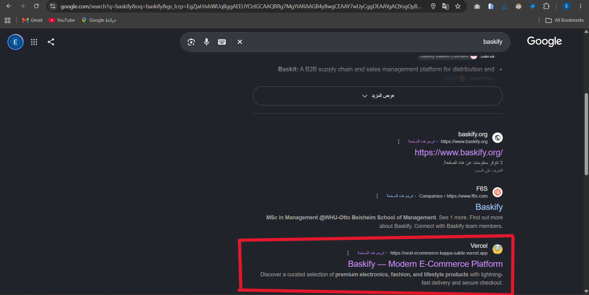

# Baskify | Production E-Commerce Platform

[](https://nextjs.org/)
[](https://react.dev/)
[](https://www.typescriptlang.org/)
[](https://tailwindcss.com/)
[](https://supabase.com/)
[](https://stripe.com/)
[](https://tanstack.com/)
[](https://zustand-demo.pmnd.rs/)

Baskify is an e-commerce platform built with **Next.js 16 (App Router & Turbopack)**, **React 19**, **Supabase (PostgreSQL & SSR Auth)**, **Stripe Payments**, and **Tailwind CSS v4**. Engineered not to be perfect, but to be enough.

My biggest achievement here is searching for "baskify" on Google and seeing my 2-month-long project right on the first page. This is my first website to do this and will not be the last. Of course, I learned so much and solved problems I did not think about before like the 4 problems you will see in [Technical Challenges & Solutions](#technical-challenges--solutions). But my most proud moment is seeing it live and indexed on Google.



---

## Key Highlights

- **Frictionless Authentication & 6-Digit Email OTP**: Custom authentication flow with Supabase SSR cookies, Google OAuth, and an in-tab 6-digit email verification code that preserves cart state and returns buyers directly to checkout without external app redirects.
- **Thread-Safe Inventory & Race Condition Defense**: Atomic PostgreSQL RPC functions (`decrement_product_stock`) paired with unique database constraints (`stripe_payment_intent_id`) and an automated Stripe refund fallback to eliminate overselling, duplicate webhook handling, and lost update bugs.
- **Targeted Server-Action Mutations (`useAdminMutation`)**: Reusable client hook integrating Next.js Server Actions with TanStack Query. Executes async mutations, selectively invalidates only affected entity query keys (products/categories) for 0ms catalog freshness, and provides unified toast feedback without full-page reloads.
- **Advanced SEO & Search Engine Indexing**: Dynamic 1200×630 OpenGraph card generation via `@vercel/og`, Schema.org JSON-LD structured data, dynamic `sitemap.xml`, and search console verification that took Baskify straight to Google's first page.

## Technical Challenges & Solutions

### 1. Supabase Auth Rate Limiting & Verification Bottlenecks

- **The Problem:** Supabase default email provider limits outgoing authentication emails to **2 emails per hour** per project. This restricted development testing and made a critical bottleneck for production scalability. Furthermore, standard clickable verification links forced mobile users into external email app webviews with empty sandboxed storage, breaking their cart and making it appear empty.
- **The Solution:** Tried integrating **Resend** as a custom SMTP provider but it worked only for development and not in production, so I integrated **Gmail SMTP** instead as it works for both development and production. For the verification links, I replaced confirmation links with an **In-Tab 6-Digit Email OTP (`verifyOtp`)**. This validates user emails 100% while keeping customers on the exact same page, preserving their cart state and delivering instant post-verification checkout redirects.

### 2. Race Condition & Inventory Defense

- **The Problem:** In concurrent high-traffic scenarios (e.g., flash sales or rapid Stripe webhooks), e-commerce systems face three critical race conditions:
  1. **Lost Update Stock Decrement**: JavaScript read-then-write updates (`stock - quantity`) on concurrent requests overwrite each other:
     ```text
     [Request A] Reads DB: stock is 10
     [Request B] Reads DB: stock is 10 (at the exact same millisecond!)
     [Request A] Calculates 10 - 1 = 9  ──► Writes 9 to DB
     [Request B] Calculates 10 - 1 = 9  ──► Overwrites DB with 9! (1 sale lost)
     ```
  2. **Duplicate Webhook Processing**: Stripe automated retry deliveries for the same payment intent can create duplicate order records:
     ```text
     [Stripe Cloud] ──► Webhook #1 sent ──► Vercel creates Order #123 (Stock - 1)
     [Stripe Cloud] ──► Webhook #2 sent ──► Vercel creates DUPLICATE Order #123 (Stock - 1 AGAIN!)
     ```
  3. **Overselling at Checkout**: Multiple users completing checkout for the last inventory unit simultaneously:
     ```text
     [Customer A] Clicks Pay on Stripe ──► $500 captured
     [Customer B] Clicks Pay on Stripe ──► $500 captured (same second)
     Warehouse Reality: Only 1 physical item in stock!
     ```
- **The Solution:**
  - **Database Level (Atomic RPC & Idempotency):**
    - Created an atomic PostgreSQL RPC function (`decrement_product_stock`) to perform thread-safe inventory decrements directly in SQL with row-level locks, which solved the **Lost Update Stock Decrement** problem.
    - Added a PostgreSQL `UNIQUE (stripe_payment_intent_id)` constraint on the `orders` table to enforce idempotency at the database engine level, which solved the **Duplicate Webhook Processing** problem.
  - **Pre-Checkout Audit:** Added real-time inventory checks in `createCheckoutSession` prior to redirecting to Stripe, which prevents **Overselling at Checkout** in normal scenarios before payment is initiated.
  - **Auto-Refund Safety Net:** Built an automated Stripe refund handler (`stripe.refunds.create`) inside the webhook that cancels and fully refunds any order if an unforeseen microsecond race condition occurs where two buyers pay simultaneously for the final item.

### 3. TanStack Query Cache Synchronization & Invalidation

- **The Problem:** When administrators create, edit, or delete catalog items, client search widgets and category caches display stale data unless refreshed, while setting `staleTime: 0` would cause redundant database queries.
- **The Solution:** Combined server-side `revalidatePath` for static routes with a custom `useAdminMutation` client hook (`src/hooks/useAdminMutation.ts`). The hook executes the server action, triggers targeted cache key invalidations exclusively for affected entities, and renders instant feedback toasts without touching unrelated queries.

### 4. Reusable Accessible Image Upload Architecture

- **The Problem:** Recreating an image upload handler each time needed across products and categories violated DRY principles, and required complex state handling for previews, loading states, error boundaries, and keyboard accessibility.
- **The Solution:** Engineered a decoupled, reusable `ImageUploader` component (`src/components/shared/ImageUploader.tsx`) paired with a unified `uploadImage` server action (`src/actions/upload.ts`). It seamlessly integrates with React Hook Form, handles Supabase storage bucket uploads, provides visual previews, loading indicators, and keyboard accessibility.
- **Open-Sourced for the Community:** The full implementation was packaged and open-sourced for the community at: [`https://github.com/theeyad/image-upload-handler-for-supabase-and-nextjs`](https://github.com/theeyad/image-upload-handler-for-supabase-and-nextjs).

## Project Structure

```
next-ecommerce/
├── src/
│   ├── actions/               # Server Actions (Auth, Checkout, Admin CRUD, Uploads)
│   ├── app/
│   │   ├── (auth)/            # Auth routes (Login, Register, Forgot Password, Error)
│   │   ├── (customer)/        # Customer Storefront (Home, Products, Categories, Cart, Checkout, Profile, Orders)
│   │   ├── admin/             # Admin Dashboard (Analytics, Products, Categories, Orders)
│   │   ├── api/webhooks/      # Stripe webhook handler endpoint
│   │   ├── opengraph-image    # Dynamic OG image generators
│   │   ├── robots.ts          # Search engine crawler policies
│   │   └── sitemap.ts         # Dynamic XML sitemap generator
│   ├── components/
│   │   ├── shared/            # Reusable business components (Navbars, Search, Cards, Modals)
│   │   └── ui/                # Base design system primitives (Button, Dialog, Sheet, Toast, etc.)
│   ├── hooks/                 # Custom React hooks (useAdminMutation, useMobile)
│   ├── lib/
│   │   ├── constants/         # E-commerce constants (Tax rates, shipping fees)
│   │   ├── store/             # Zustand stores (productsStore)
│   │   ├── stripe.ts          # Stripe SDK client instance
│   │   ├── supabase/          # Supabase client factories (Client, Server, Admin, Middleware)
│   │   └── validation/        # Zod validation schemas and TypeScript contracts
│   └── proxy.ts               # Next.js Edge proxy middleware for route protection & RBAC
├── public/                    # Static assets, SVG logos, Google branding
├── .env.local                 # Local environment variables
└── next.config.ts             # Next.js configuration & image domains
```

---

## Getting Started

### Prerequisites

- **Node.js**: `v20.0.0` or higher
- **npm** or **pnpm**
- **Supabase Account** & **Stripe Account**
- **Stripe CLI** (for local webhook testing)

### Installation & Local Setup

1. **Clone the repository**

   ```bash
   git clone https://github.com/theeyad/next-ecommerce.git
   cd next-ecommerce
   ```

2. **Install dependencies**

   ```bash
   npm install
   ```

3. **Database Setup (Supabase Migrations)**
   Open the **SQL Editor** in your Supabase dashboard and execute the migration scripts located in [`src/lib/supabase/migrations/`](src/lib/supabase/migrations/) in this order:
   - `tables.sql` _(core schema: profiles, products, categories, orders, order_items)_
   - `triggers.sql` _(atomic `decrement_product_stock` RPC & profile sync triggers)_
   - `rls.sql` _(Row Level Security policies)_
   - `catalog-image-rls.sql` & `profile-image-rls.sql` _(Storage bucket policies)_

4. **Google OAuth Configuration**
   To enable Google one-click authentication:
   1. Go to the [Google Cloud Console](https://console.cloud.google.com/) > **APIs & Services** > **Credentials**.
   2. Create an **OAuth 2.0 Client ID** (Application type: _Web application_).
   3. Add Authorized Redirect URI:  
      `https://<your-supabase-project-ref>.supabase.co/auth/v1/callback`
   4. In your [Supabase Dashboard](https://supabase.com/dashboard), navigate to **Authentication** > **Providers** > **Google**:
      - Toggle Google **ON**.
      - Paste your Google **Client ID** and **Client Secret**.
   5. Under **Authentication** > **URL Configuration**, add your callback to **Redirect URLs**:  
      `http://localhost:3000/auth/callback` (and your production URL for deployment).

5. **Configure Environment Variables**
   Create a `.env.local` file in the project root:

   ```env
   # Supabase
   NEXT_PUBLIC_SUPABASE_URL=https://your-project.supabase.co
   NEXT_PUBLIC_SUPABASE_PUBLISHABLE_KEY=your_publishable_key
   SUPABASE_SECRET_KEY=your_service_role_key

   # Base URL (Used for OAuth callbacks and redirects)
   NEXT_PUBLIC_SITE_URL=http://localhost:3000

   # Stripe
   STRIPE_SECRET_KEY=sk_test_...
   NEXT_PUBLIC_STRIPE_PUBLISHABLE_KEY=pk_test_...
   STRIPE_WEBHOOK_SECRET=whsec_...
   ```

6. **Forward Stripe Webhooks (Local Development)**
   Listen for local Stripe events and obtain your local webhook secret:

   ```bash
   stripe listen --forward-to localhost:3000/api/webhooks/stripe
   ```

   _Copy the printed `whsec_...` signing secret into your `.env.local` as `STRIPE_WEBHOOK_SECRET`._

7. **Launch the development server**
   ```bash
   npm run dev
   ```
   Open [http://localhost:3000](http://localhost:3000) to view the application.

---

## Available Scripts

In the project directory, you can run:

| Command         | Description                                                                        |
| :-------------- | :--------------------------------------------------------------------------------- |
| `npm run dev`   | Starts the Next.js Turbopack development server with Hot Module Replacement (HMR). |
| `npm run build` | Builds the optimized production bundle across all static and dynamic routes.       |
| `npm run start` | Starts the Next.js production server.                                              |
| `npm run lint`  | Runs Next.js ESLint checks across the codebase.                                    |

---
